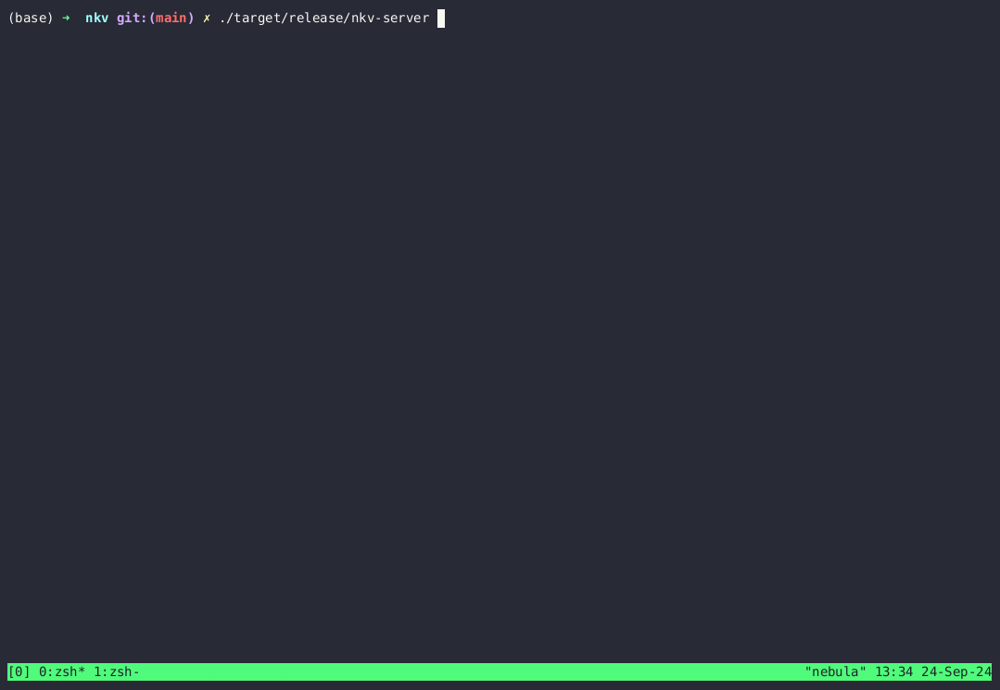

# Notify Key Value Storage (nkv)



### What is it for? 
nkv lets you share state between your services using client server topology. 
it provides you with following API:

- get the state for the given key
- put the state for the given key
- delete the state for the given key
- subscribe to the updates for the given key
- unsubscribe from the updated for the given key

Note that nkv supports keyspace, more info you can find [here](./docs/KEYSPACE.md). 

Also note that nkv clients recieve latest state and transitional states might be lost due to load.
For more information reffer to [this](./docs/DESIGN_DECISIONS.md)

### When should I use it?
When you have some shared state between services/processes and you also want to be notified when the value is changed

### How do I use it?

#### Using docker containers

You can directly pull docker containers for client and server. They are published with each release:

Make sure that you have docker [installed](https://docs.docker.com/engine/install/)

```sh
docker run -d --net=host ghcr.io/uncledecart/nkv-main:latest ./nkv-server "0.0.0.0:4222"
docker run -it --net=host ghcr.io/uncledecart/nkv-main:latest ./nkv-client "4222"
```

when using network other than the host, the network implementation may impact network performance, unrelated to nkv itself.
Also docker container builds nkv with musl, not glibc, which introduce slight perfomance degradation but gives way
smaller container size, for more information refer to [Design decisions doc](./docs/DESIGN_DECISIONS.md)

#### Building locally

If you want latest version or you want to modify `nkv` to use different storage or notification policies,
you can build and run `nkv` locally. In order to use it you should install Rust programming language.
If you're running Linux or OSX you can do so via `rustup`

```sh
curl --proto '=https' --tlsv1.2 -sSf https://sh.rustup.rs | sh
```

For Windows installation on and other methods see [here](https://forge.rust-lang.org/infra/other-installation-methods.html)

Then you can simply do following

```sh
git clone git@github.com:uncleDecart/nkv.git
cd nkv
cargo build --release
```

And you'll see `nkv-server` and `nkv-client` binaries in `target/release` folder

Start a server by running the binary `nkv-server`, passing it the hostname and port on which to listen,
e.g. `localhost:8000`. If you pass none, it defaults to `localhost:4222`. 

```sh
nkv-server localhost:4222
```

Then you can use a client to access the server.

You can use the client binary `nkv-client` to interact with the server, or any library that supports the
protocol.

To run the client binary, you can use the following commands:

```sh
$ nkv-client localhost:4222
get key1
put key1 value1
delete key1
quit
help
```

Each line starts with the command, followed by the arguments. Enter the `help` command
for a list of available commands. Each command ends with a newline character, after which the server
responds.

The first and only argument to `nkv-client` is the hostname and port on which the server is running.
If none is provided, it defaults to `localhost:4222`.

For detailed info about design you can find [here](./docs/DESIGN.md)

### What clients does `nkv` implement?

Apart from application you can use `nkv` in

- [Rust](./docs/CODING_RUST.md)

 However, underlying design principle is that `nkv` is using OS primitives, making it possible to write clients in any language. Just write marshalling and demarshalling in JSON and be sure that you can connect to `Server` and handle `Notifier`. For detailed specification on components reffer to this [doc](./docs/DESIGN.md)

### Background

Initially, idea for such design came up in discussions with @deitch talking about improving messaging
system inside [EVE project](https://github.com/lf-edge/eve) called PubSub. We clearly understood one thing:
serverless distributed messaging between services did was not exactly the right way to approach the problem.
What we actually needed was some kind of persistent key-value storage, but with a twist: we want it to notify us when 
there is a change in a value. So all the clients will be able to sync over the value.
Such communication mechanism would be perfect for EVE. In terms of performance the important part for us was
smaller footprint and we also kept in mind that number of connections will be hundreds maximum.

